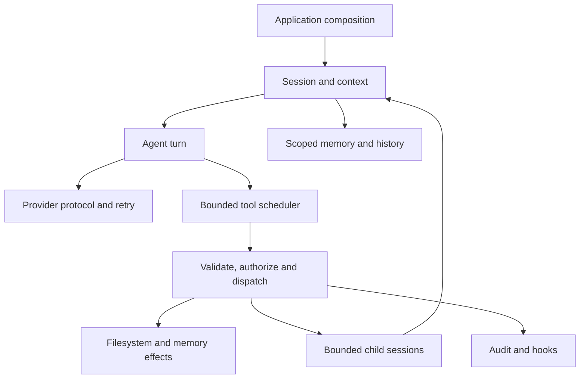

# Architecture

Orangutan is a C++26 agent runtime. Its first useful boundary is a completed turn:
load scoped context, call a provider, execute authorized tools, return tool
results to the provider, and persist the response. The
[agent contract](design-docs/agent-platform.md) also composes bounded child turns
through that boundary; [STATUS.md](STATUS.md) records verification.

## Functional Core And Effects

Policy evaluation, prompt rendering, schema validation and message conversion
operate on explicit values. They do not discover configuration or start work.
Provider, filesystem and SQLite operations are effect boundaries coordinated by
Asio. RAII owns resources; cancellation requests are followed by a lifetime join.

Conversation preparation returns an owned value and a persistence boundary.
The session coordinator loads history, dispatches scoped recall, runs a turn and
persists its completed suffix. Memory adapters borrow explicit storage services;
tool promotion remains session-local state. New abstractions must express a
current domain boundary with a concrete caller.



## Boundaries

| Library | Responsibility |
| --- | --- |
| `oran-core` | Messages, identifiers, errors, capabilities and value utilities. |
| `oran-async` | Executors, cancellation, bounded queues and owned child work. |
| `oran-io` | Filesystem operations, pinned authority handles and blocking work. |
| `oran-http` | Bounded HTTP/SSE transport. |
| `oran-storage` | SQLite, migrations, pools and repositories. |
| `oran-config` | Parse and validate explicit configuration values. |
| `oran-permission` | Rules, decisions, bounded approval grants and audit sinks. |
| `oran-hook` | Typed effect gates and advisory lifecycle observations. |
| `oran-memory` | Session serialization, scoped records and lexical recall. |
| `oran-tool` | Tool definitions, input validation, authorization and handlers. |
| `oran-prompt` | Deterministic cached sections and tool catalogue selection. |
| `oran-provider` | Protocol mapping, credential boundary, retries and fallback. |
| `oran-agent` | Provider/tool turn execution, bounded scheduling and promotion state. |
| `oran-bootstrap` | Construct resources and drive one session from the application. |

`orangutan` is the single executable. It accepts an explicit configuration and
prompt. Its argument parser is a thin host for the runtime. Libraries do not
depend on executable flags or terminal output. See [BUILD_SYSTEM.md](BUILD_SYSTEM.md).

Dependencies flow toward domain values and platform primitives. Intentional
same-layer edges are HTTP/IO/storage → async, config → storage, tool →
permission/hook, prompt → tool and provider → prompt. The graph is checked by
`scripts/check-deps.sh`. The composition root joins runtime, memory and transport.

## Authority And State

Each turn carries session, agent and scope identity. A tool definition declares
required capabilities; an explicit rule decision grants or refuses the concrete
operation. Filesystem handlers receive pinned authority handles after path
resolution. Approval binds the identity, tool and exact approved input.

Session history and personal records are separate stores. Prompt history reads
are bounded; persisted history remains intact. Session-memory SQLite calls run on the blocking
executor. Hooks and coordinating state run on the session's strand. Audit/trace
SQL offloading remains tracked integration work.

`AgentRun` reuses the turn boundary with independent child sessions. Parent and
child policy decisions intersect at dispatch. Children share the parent's
workspace, memory scope, provider route and tool scheduler; fresh approval
identities keep grants separate. Child counts and delegation depth are bounded,
and parent cancellation joins borrowed child work.

## Public Headers

```text
<oran/agent.hpp> <oran/async.hpp> <oran/bootstrap.hpp> <oran/config.hpp>
<oran/hook.hpp> <oran/http.hpp> <oran/io.hpp> <oran/memory.hpp>
<oran/permission.hpp> <oran/prompt.hpp> <oran/provider.hpp>
<oran/storage.hpp> <oran/tool.hpp>
```

Use a narrow header when it avoids pulling unrelated declarations into a
translation unit. Heavy third-party definitions stay in implementation files.
The [design index](design-docs/index.md) routes detailed contracts.
